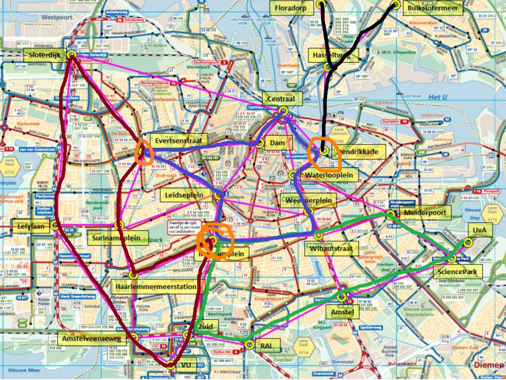
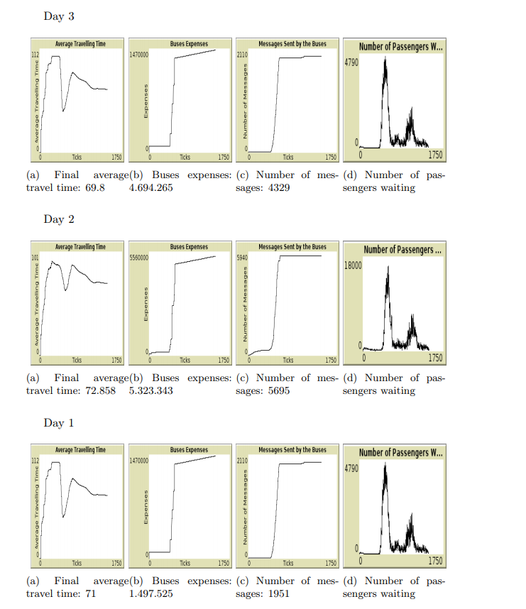

  

# Smart Transportation System
This repository contains the corresponding training code for [**the project**](https://v2.overleaf.com/read/dwwkpbmyzqtf).

In this project we implement an autonomous public transportation system that makes use of intelligent agents. Those agents have beliefs and intentions and seek to carry out their own tasks while maximizing their personal utility. As new agents are injected into the system, we discuss how they can leverage on communication protocols, coordination and competition strategies in order to improve the overall system efficiency. Please read the [report](report.pdf) for more detailed information.

## Using the code 
1. Download the program [NetLogo](https://ccl.northwestern.edu/netlogo/).
2. Clone this repository
4. Open the file `Amsterdam_v6.3.nlogo` with NetLogo and run it

## Results 
The results show that our model is able to maintain a low waiting time when sudden surges of travellers (rush-hours) happen by using its resources efficiently.

  

